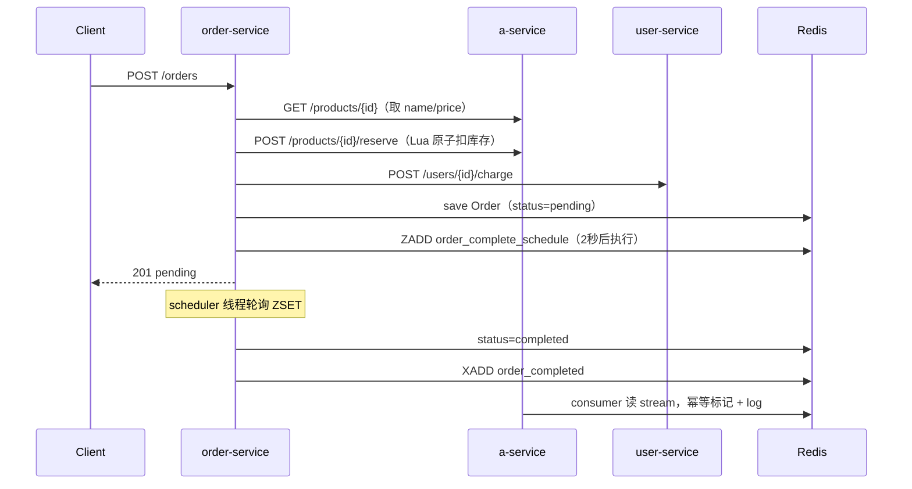
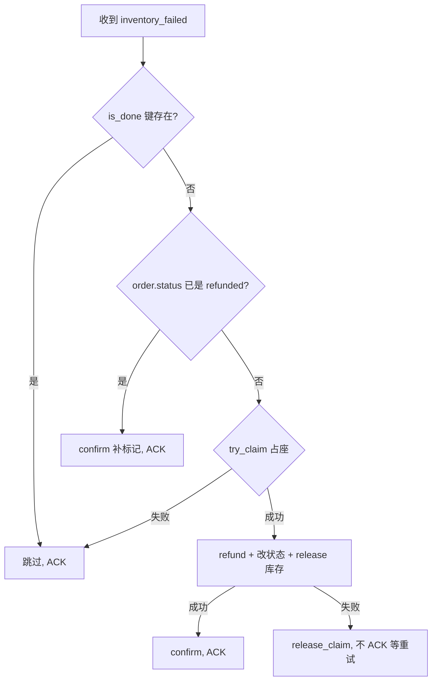

# fastapi-demo 架构与幂等说明

重读本文档可快速回顾：下单链路、库存预占、退款补偿、Redis Stream、幂等键设计。

---

## 服务一览

| 服务 | 端口 | 职责 |
|------|------|------|
| user-service | 8001 | 用户、余额、`charge` / `refund` |
| order-service | 8002 | 订单 CRUD、延迟完成 scheduler、退款 consumer |
| a-service | 8003 | 商品 CRUD、库存 `reserve` / `release`、履约 consumer |

共享 Redis（`REDIS_OM_URL`）：订单/商品 HashModel、Stream、ZSET 延迟队列、幂等键。

---

## 完整下单链路（Happy Path）



**要点：**

- 库存在 **下单时** 通过 `reserve` 扣减，不是 2 秒后再扣。
- `order_completed` stream 现在是 **履约通知**，a-service consumer 只打日志。
- 完成订单用 **Redis ZSET** 持久化，不用 `BackgroundTasks`（重启不丢任务）。

---

## 库存：reserve / release

**文件：** `services/a/app/inventory.py`

```text
reserve：Lua 脚本在 Redis 内 读 quantity → 判断够不够 → 写回
release：Lua 脚本 quantity += n（退款时归还）
```

并发 10 个下单请求，只有 `quantity` 允许的数量能 `reserve` 成功（409），不会超卖。

**下单失败回滚（order-service）：**

| 失败点 | 补偿 |
|--------|------|
| charge 失败 | `release` 还库存 |
| Order.save 失败 | `release` + `refund` |

---

## 退款补偿流

仍保留 `inventory_failed` stream（极端场景：商品被删等）。正常路径下 reserve 在下单时已完成，一般不走这条。

```text
inventory_failed 消息
  → order-service refund consumer
  → 退钱（user-service /refund）
  → 订单 status = refunded
  → a-service /release 还库存
```

---

## 幂等：为什么需要？

Redis Stream 可能 **重复投递** 同一条消息（consumer 崩溃未 ACK、网络重试、bug 重复 XADD）。

没有幂等时：

```text
同一条「退 100 元」消息来 2 次 → 用户收到 200 元
```

**目标：** 同一个 `order_id` 的副作用（发 stream、记履约、退款）**最多执行一次**。

---

## 核心 Redis 命令：SETNX

```python
redis.set(key, value, nx=True, ex=604800)
```

| 参数 | 含义 |
|------|------|
| `nx=True` | **仅当 key 不存在时** 才写入（Set if Not eXists） |
| `ex` | TTL，过期自动删 |

```text
第 1 次 SETNX  →  True   →  「我抢到处理了」
第 2 次 SETNX  →  False  →  「别人做过了，我跳过」
```

---

## 两套幂等实现

### 1. 简单版 — a-service（无副作用重复）

**文件：** `services/a/app/idempotency.py`  
**键：** `order_fulfilled:{order_id}`

```python
is_fulfilled()   # EXISTS，有则跳过
mark_fulfilled() # SETNX "1"，占坑 7 天
```

consumer 收到重复的 `order_completed` → 已存在键 → 直接 ACK，不再打两遍 log 逻辑。

适用场景：处理逻辑很轻、失败也无所谓，**一步 SETNX 足够**。

---

### 2. 完整版 — order-service（有副作用：退钱、发 stream）

**文件：** `services/order-service/app/idempotency.py`

三个状态，像 **占座**：

| 状态 | Redis 值 | 含义 |
|------|----------|------|
| （无键） | — | 还没人处理 |
| 处理中 | `"processing"` | 正在做，别并发重复做 |
| 已完成 | `"done"` | 做完了，永久跳过（7 天 TTL） |

四个函数：

```python
try_claim(key)      # SETNX = "processing"（1h TTL）  占座
confirm(key)        # SET = "done"（7d TTL）            确认完成
release_claim(key)  # DEL                               失败释放，允许重试
is_done(key)        # EXISTS                            键还在就跳过
```

**为什么 refund 需要 try_claim + confirm，而不是一次 SETNX？**

退款要调 HTTP、改订单、还库存，**中间可能失败**。需要：

```text
成功  → confirm（标记 done，以后都跳过）
失败  → release_claim（删键）+ 不 ACK stream（消息重投后再试）
```

如果只 SETNX 从不删除，一次失败就永远不能再退。

---

## 三个幂等键各管哪一段

| Redis 键 | 写入方 | 防什么 |
|----------|--------|--------|
| `order_complete_published:{order_id}` | order-service scheduler | ZSET 重复触发、重复 `XADD order_completed` |
| `order_fulfilled:{order_id}` | a-service consumer | 重复消费 `order_completed` |
| `order_refunded:{order_id}` | order-service refund consumer | 重复退款、重复 release 库存 |

一条订单正常只走前两个；只有异常才走第三个。

---

## 退款 consumer 决策流程

**文件：** `services/order-service/app/consumer.py` → `_handle_message`



**和「只查 order.status」的区别：**

- 查 `status`：业务层，订单已 refunded 则跳过。
- Redis 键：基础设施层，**两个 consumer 同时**读到同一条消息时，只有一个 `try_claim` 成功。

两层一起用更稳。

---

## scheduler 发 order_completed 的幂等

**文件：** `services/order-service/app/complete_scheduler.py`

```text
ZADD order_complete_schedule  {order_pk: 执行时间戳}
scheduler 轮询到期 pk
  → is_done / try_claim（order_complete_published:{pk}）
  → 改 completed + XADD order_completed
  → confirm
  → ZREM 调度项
```

服务重启后 ZSET 里未执行的任务仍在，scheduler 会继续处理；幂等键保证不会发两条 stream。

---

## Redis Stream 与 Consumer Group

| Stream | 生产者 | 消费者 | 作用 |
|--------|--------|--------|------|
| `order_completed` | order-service scheduler | a-service | 履约通知 |
| `inventory_failed` | a-service（异常时） | order-service | 触发退款 |

Consumer 使用 `XREADGROUP` + `XACK`：

- 处理成功（或幂等跳过）→ `ACK`
- 临时失败（如 refund HTTP 超时）→ **不 ACK**，消息重新投递

---

## 健康检查

**文件：** `consumer_state.py`（a / order 各一份）

每个 worker 循环里 `heartbeat()` 更新时间戳。`/health` 检查：

- consumer 线程是否存活
- 最近 10s 内是否有 heartbeat

异常 → HTTP **503**，`consumers.* = unhealthy`。

---

## 工程细节

### REDIS_OM_URL 初始化顺序

`main.py` 里必须 **先** `os.environ["REDIS_OM_URL"] = settings.redis_om_url`，**再** `from redis_om import ...` / 导入 `models`。否则 HashModel 可能连到 `localhost:6379`。

### httpx `trust_env=False`

本地有 Clash/Surge 等代理时，httpx 默认走代理访问 `127.0.0.1` 会 502。服务间调用需直连。

---

## 相关文件索引

```text
fastapi-demo/
├── ARCHITECTURE.md          ← 本文档
├── TODO.md                  ← 待办与历史问题
├── services/a/app/
│   ├── inventory.py         # Lua reserve/release
│   ├── idempotency.py       # order_fulfilled:*
│   ├── consumer.py          # order_completed 消费者
│   └── main.py              # /reserve /release /health
├── services/order-service/app/
│   ├── idempotency.py       # try_claim / confirm / release_claim
│   ├── complete_scheduler.py # ZSET 延迟完成 + 发 stream
│   ├── consumer.py          # inventory_failed 退款消费者
│   ├── routers/orders.py    # 下单 + schedule
│   └── main.py              # 启动 scheduler + refund worker
└── services/user-service/app/
    └── routers/users.py     # charge / refund
```

---

## 一句话总结

> **下单时 Lua 原子占库存；完成订单用 Redis ZSET 持久延迟；Stream 解耦履约与退款；幂等键用 SETNX 保证同一 order_id 的副作用只执行一次，失败删键允许重试。**
