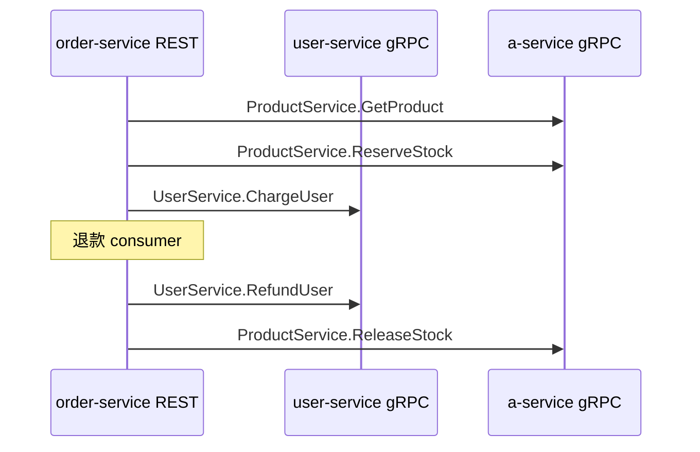

# gRPC 迁移说明

服务间同步调用已从 **HTTP/httpx** 改为 **gRPC + protobuf**。对外 REST 仍保留在 order-service（8002）和 a-service 管理接口（8003）。

## 端口

| 服务 | REST | gRPC |
|------|------|------|
| user-service | （已移除） | **50051** |
| order-service | 8002 | — |
| a-service | 8003 | **50053** |

## Proto 定义

```text
proto/user/v1/user.proto       → UserService
proto/product/v1/product.proto → ProductService
```

生成代码：`pnpm fastapi:proto` 或 `make -C fastapi-demo proto`

输出目录：`gen/python/`

## 改造清单

### 新增

| 路径 | 说明 |
|------|------|
| `proto/**/*.proto` | 接口契约 |
| `gen/python/**` | protoc 生成物（需提交） |
| `scripts/generate_proto.sh` |  codegen 脚本 |
| `user-service/app/store.py` | 用户业务逻辑 |
| `user-service/app/grpc_servicer.py` | gRPC 实现 |
| `a-service/app/grpc_servicer.py` | 商品 gRPC 实现 |
| `a-service/app/grpc_server.py` | gRPC 线程 |
| `order-service/app/clients/grpc_errors.py` | RpcError → HTTPException |

### 修改

| 路径 | 变更 |
|------|------|
| `user-service/app/main.py` | uvicorn → `grpc.aio` 纯 gRPC |
| `a-service/app/main.py` | 启动 gRPC 线程；移除 `/reserve` `/release` HTTP |
| `order-service/app/clients/user_client.py` | httpx → `UserServiceStub` |
| `order-service/app/clients/product_client.py` | httpx → `ProductServiceStub` |
| `order-service/app/consumer.py` | 同步 gRPC refund/release |
| `order-service/app/config.py` | `*_grpc_target` 替代 `*_url` |
| `docker-compose.yml` | gRPC 端口 + build context |
| 各 `Dockerfile` | 复制 `gen/python`，设置 `PYTHONPATH` |
| `Makefile` / `package.json` | 启动命令与 env |

### 未改（仍是 Redis）

- `order_completed` / `inventory_failed` Stream
- `order_complete_schedule` ZSET
- 幂等键、consumer 逻辑

## 本地启动

```bash
pnpm fastapi:install
pnpm fastapi:proto

# 三个终端
pnpm fastapi:user    # gRPC :50051
pnpm fastapi:a       # REST :8003 + gRPC :50053
pnpm fastapi:order   # REST :8002
```

## gRPC 调用关系



## 错误码映射

| gRPC Status | order-service HTTP |
|-------------|-------------------|
| NOT_FOUND | 400 |
| FAILED_PRECONDITION | 400（余额不足/库存不足） |
| UNAVAILABLE | 503 |
| 其他 | 502 |

## 调试

```bash
# 需安装 grpcurl
grpcurl -plaintext localhost:50051 list
grpcurl -plaintext -d '{"user_id":1}' localhost:50051 user.v1.UserService/GetUser
grpcurl -plaintext -d '{"name":"alice","balance":1000}' localhost:50051 user.v1.UserService/CreateUser
```

## 后续可选

- order-service 对外也暴露 `OrderService` gRPC
- 启用 gRPC reflection
- mTLS / 服务网格
