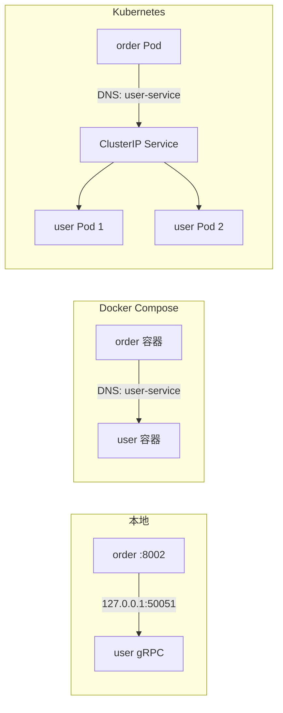

# 服务发现与端口说明

> 重读本文档可快速回顾：本 demo 如何找服务、生产里怎么做、端口要不要固定。

相关文档：[GRPC.md](./GRPC.md) · [ARCHITECTURE.md](./ARCHITECTURE.md)

---

## 一句话

**服务发现 = 调用方如何知道「依赖服务在哪」**（IP + 端口），并在实例变化时仍能连上。

本 demo **没有** Consul/Nacos 这类注册中心，用的是 **环境变量写死 host:port + DNS 解析服务名**。生产通常换成 **K8s Service DNS** 或注册中心。

---

## 本项目的端口（本地 / Compose 约定）

| 服务 | REST | gRPC | 谁调用 |
|------|------|------|--------|
| user-service | — | **50051** | order-service（扣款/退款） |
| a-service | **8003** | **50053** | order-service（查商品/占库存） |
| order-service | **8002** | — | 外部客户端（下单） |

这些是 **开发/演示约定**，不是生产标准。生产对外一般只暴露 API Gateway 的 **443**，内部 gRPC 端口可配置，调用方靠 **服务名** 而非记 IP。

---

## 本 demo 怎么「找」依赖服务

### 配置入口

order-service 通过 env 拿到 gRPC 地址：

```python
# services/order-service/app/config.py
user_service_grpc_target: str = "127.0.0.1:50051"
a_service_grpc_target: str = "127.0.0.1:50053"
```

每次 RPC 使用该 target 建 channel：

```python
# services/order-service/app/clients/user_client.py
async with grpc.aio.insecure_channel(settings.user_service_grpc_target) as channel:
    stub = user_pb2_grpc.UserServiceStub(channel)
    ...
```

**没有**自动注册、没有动态刷新列表——改地址 = 改 env 重启。

### 三种运行环境对比

| 环境 | `USER_SERVICE_GRPC_TARGET` | 谁做「发现」 |
|------|---------------------------|--------------|
| 本地三终端 | `127.0.0.1:50051` | 人工约定端口 |
| Docker Compose | `user-service:50051` | Compose 内置 DNS |
| K8s（典型生产） | `user-service:50051` 或 FQDN | kube-dns + Service |



---

## Docker Compose：最简服务发现

`docker-compose.yml` 里 order-service 的配置：

```yaml
environment:
  USER_SERVICE_GRPC_TARGET: user-service:50051
  A_SERVICE_GRPC_TARGET: a-service:50053
depends_on:
  - user-service
  - a-service
```

- **`user-service`** 是 Compose service 名，容器内 DNS 自动解析为对应容器 IP。
- **`depends_on`** 只保证容器**先创建**，不保证 gRPC 已 listen（可能短暂 503）。
- 仍是**静态配置**：新增实例不会自动写进 env，靠 Compose 网络 DNS 解析**单个** service 名。

---

## 生产：Kubernetes Service（最常见）

每个微服务部署 Deployment + Service：

```yaml
apiVersion: v1
kind: Service
metadata:
  name: user-service
spec:
  selector:
    app: user-service
  ports:
    - port: 50051
      targetPort: 50051
```

order-service 的 env 不变：

```
USER_SERVICE_GRPC_TARGET=user-service:50051
```

调用链：

```
order Pod
  → DNS 查询 user-service
  → 得到 ClusterIP（稳定虚拟 IP）
  → kube-proxy / CNI 转发到某个 ready 的 user Pod
```

Pod 重建、IP 变了，**Service 名和 ClusterIP 不变**，客户端无需改配置。多副本时 Service 做负载均衡。

### 对外 vs 对内

```
Internet → Ingress(443) → order-service Service → order Pod
                              ↓ 集群内 gRPC
                         user-service / a-service（ClusterIP，不暴露公网）
```

---

## 其他生产方案（了解即可）

| 方案 | 原理 | 适用 |
|------|------|------|
| **K8s Service + DNS** | 控制面维护 Endpoints，DNS 解析 | 默认首选 |
| **Headless Service** | 无 ClusterIP，DNS 返回所有 Pod IP | gRPC 客户端负载均衡 |
| **Consul / Nacos / etcd** | 服务启动注册，客户端/watch 拉列表 | 多集群、非 K8s |
| **Service Mesh（Istio 等）** | Sidecar 代理，透明路由/重试/mTLS | 大规模、统一治理 |
| **云厂商** | AWS Cloud Map、阿里云 MSE 等 | 托管减少运维 |

本 demo 未集成以上任一方案；迁移时通常**只改部署与 env**，业务代码继续读 `*_grpc_target` 即可。

---

## 启动顺序 vs 服务发现

| | 本地手动起 | Docker Compose | 生产 K8s |
|---|-----------|----------------|----------|
| 顺序 | 建议 user → a → order | 并行起 | 并行起 |
| 依赖未 ready | 手动等 / 重试 | 可能短暂 503 | readiness 探针 + 客户端重试 |
| 流量切入 | 立即 | 立即 | **仅 ready Pod 接流量** |

生产**不要求**全局串行启动，靠：

1. **Readiness Probe** — `/health` 或 gRPC `HealthCheck` 通过才进 Service
2. **客户端重试** — `UNAVAILABLE` 指数退避（demo 已有 503 映射，未加重试）
3. **异步解耦** — Redis Stream 消费者可等服务恢复后再消费

本项目的 HealthCheck RPC：`user.v1.UserService/HealthCheck`、`product.v1.ProductService/HealthCheck`。

---

## 端口 FAQ

**Q：生产也用 50051 / 8002 这些端口吗？**

可以，但不必须。重要的是 **同一套配置在各环境一致**（dev/staging/prod 用不同 env 文件），而不是全球统一端口号。

**Q：为什么 gRPC 常用 50051？**

历史习惯 + 避免与 HTTP 80/8080 冲突；K8s 里 `port` / `targetPort` 可任意映射。

**Q：demo 和生产的最大区别？**

| | Demo | 生产 |
|---|------|------|
| 实例数 | 单实例 | 多 Pod，IP 常变 |
| 发现方式 | env + 单机 IP 或 Compose DNS | Service DNS / 注册中心 |
| 对外暴露 | 8002/8003 直连 | 仅 Gateway 443 |
| 依赖挂了 | 503，手动重试 | 探针摘除 + 自动重试 |

---

## 代码索引

| 文件 | 说明 |
|------|------|
| `services/order-service/app/config.py` | gRPC target 配置 |
| `services/order-service/app/clients/user_client.py` | 使用 target 调 user-service |
| `services/order-service/app/clients/product_client.py` | 使用 target 调 a-service |
| `services/order-service/app/clients/grpc_errors.py` | `UNAVAILABLE` → HTTP 503 |
| `docker-compose.yml` | Compose 服务名与 env |
| `package.json` `fastapi:order` | 本地默认 target |
| `.env.example` | 环境变量模板 |

---

## 后续可加强（未做）

- [ ] Compose `healthcheck` + `depends_on: condition: service_healthy`
- [ ] gRPC 客户端连接池 + `UNAVAILABLE` 重试
- [ ] K8s 部署清单（Deployment / Service / Ingress）
- [ ] gRPC reflection 便于 grpcurl 调试
