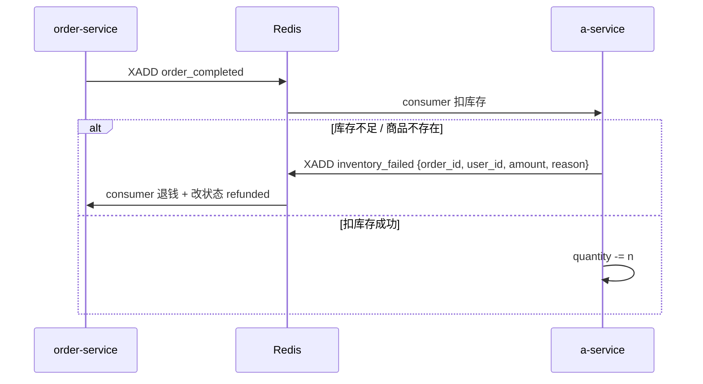

# fastapi-demo TODO

当前链路：下单校验库存 → 2s 后 order `completed` + `XADD order_completed` → a-service consumer 扣减 `Product.quantity`。

---

## 已知问题

### 1. 超卖 + 已扣款不退

**位置：** `services/a/app/consumer.py` — 库存不足时只打 log 并 `return`。

**场景：**

```
下单时校验库存 ✓  →  2s 后 order=completed + xadd  →  a-service 扣库存 ✗（没货了）
```

用户侧订单已是 `completed`、钱已扣，但库存扣失败，**没有任何补偿**。

**方向：** a-service 在缺货 / 商品不存在时 `XADD inventory_failed`，order-service consumer 退钱并将订单改为 `refunded`。

---

### 2. XACK 过早，失败消息被吞掉

**位置：** `services/a/app/consumer.py` — `_handle_message` 之后无条件 `XACK`。

无论扣库存成功还是失败，消息都会从 pending 列表消失，**无法重试，也无法进死信队列**。

**方向：**

- 成功 → `XACK`
- 可补偿失败（缺货、商品不存在）→ `XADD inventory_failed` 再 `XACK`
- 临时错误（Redis 断连等）→ 不 `XACK`，等待重投

---

### 3. 两阶段校验的时间窗（并发超卖） — 已缓解

**方案：** 下单时调用 a-service `POST /products/{id}/reserve`，Redis Lua 原子扣减 `quantity`；退款时 `POST /products/{id}/release` 归还库存。`order_completed` consumer 不再二次扣库存。

**剩余：** charge 成功但 `Order.save` 失败时依赖 rollback；高并发下注意 Redis 连接池上限。

---

### 4. 状态机顺序不对

**现状：** 先标记 `completed`，再异步扣库存。

**更合理顺序：**

| 阶段     | 状态          | 动作                          |
|----------|---------------|-------------------------------|
| 创建     | `pending`     | 校验 + 预占库存               |
| 支付     | `paid`        | 扣用户余额                    |
| 履约     | `fulfilling`  | 发 `order_completed`          |
| 扣库存成功 | `completed` | —                             |
| 扣库存失败 | `refunded`  | 退钱                          |

当前跳过了 `fulfilling`，失败时没有回滚路径。

---

### 5. BackgroundTasks 不可靠 — 已缓解

**方案：** 下单后 `ZADD order_complete_schedule`，独立 scheduler 线程轮询到期订单并 `XADD order_completed`。任务持久化在 Redis，重启后可继续处理。

---

### 6. 无幂等保护 — 已缓解

**方案：** Redis `SETNX` 幂等键：`order_fulfilled:`（a-service）、`order_refunded:` / `order_complete_published:`（order-service）。重复消息 skip；处理失败 `DEL` 键允许重试。

---

### 8. 其他工程问题

- **httpx 本地 502：** 已在 order-service client 加 `trust_env=False`。
- **consumer 是 daemon 线程：** `/health` 检查 consumer heartbeat，异常时返回 503。
- **stream 字段全是 str：** `order.model_dump()` 转 string 后 `XADD`，consumer 需自行 cast；字段缺失时静默 skip。

---

## 建议的补偿流（inventory_failed）



order-service 侧需要：

- 新 consumer 监听 `inventory_failed`
- 订单状态：`completed` → `refunded` / `failed`
- 调 user-service / payment 退 `amount`

---

## 建议实施顺序

- [x] **P0** — `inventory_failed` stream：a-service 缺货/无商品时发布，order-service consumer 退钱改状态
- [x] **P0** — 修正 XACK 逻辑：只有「处理完毕（成功或已发补偿事件）」才 ack
- [x] **P1** — 下单原子预占库存，消除并发超卖
- [x] **P1** — 订单状态补 `refunded` / `fulfilling`，完善状态机（已加 `refunded`，`fulfilling` 待做）
- [x] **P2** — 幂等键 `order_fulfilled:{order_id}` / `order_refunded:{order_id}` / `order_complete_published:{order_id}`
- [x] **P2** — BackgroundTasks 换 Redis ZSET 延迟队列（`order_complete_schedule`）
- [x] **P2** — consumer 健康检查（/health 503）；httpx `trust_env=False`
